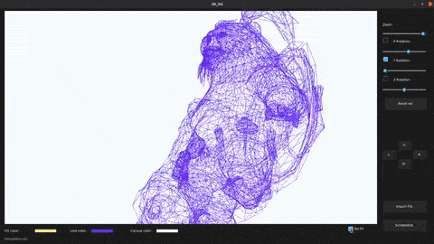

# Build a 3D rendering desktop app from scratch with Python



> [V1 Demo YouTube video](https://youtu.be/G0m2wwEppWA) | [V2 Code walkthrough YouTube video](https://youtu.be/Ca8nKtICYMk)

---

## New version !

This folder was changed as there was only 3 source files, now there exists **V1_SOURCE** ~and **V2_SOURCE**~ where the **V1** contains the original files (not recommended to use), ~and the **V2**~ the **src** contains the new version of the project that adapts an **OOP** approach and a cleaner code structure, as well as some enhancements along with some new features.

**What's new?**

- OOP approach
- The 3D model is only redrawn (rerendered) when there's a change 
- Faces are now being drawn **completely** (no matter how many vetrecies)
- Points that aren't in the screen are no longer rendered
- Rotation ~isn't~ is either continous, ~instead~ or a custom degree on each axis
- New controls for Line color, Filling color, canvas color
- Filling could be turned ON and OFF
- Scrolling inside the drawing canvas zooms in/out the object

---

## Description

This project was made as a practice for Python programming, Matrix manipulation, file processing, and general system engineering processes.

Also it was a way for me to explore an interesting field for me which is graphics (2D, and 3D).

It's a desktop app that takes in waveform files (.OBJ) and visualizes its triangulated form ~(no filliing, no shading, no texturing! just triangles)~ 

~The **V2** (Legacy_versions/V2_SOURCE) of the project adds a filling option with control over the color of the filling as well as whether it's turned ON or OFF.~

### Key Words

- Python: Numpy, Tkinter, re (regex), 3D graphics, Numba.
- Waveform files (.OBJ). 

---

## Disclamer

This article assumes having basic knowledge of Python, Tkinter, and Numpy, since these will not be covered here.

**About waveform files (.OBJ)**, I recommend reading this [article in Wikipedia](https://en.wikipedia.org/wiki/Wavefront_.obj_file).

Or if you're not into reading, watch this [YouTube video](https://www.youtube.com/watch?v=KMWUjNE0fYI)

---

## How to use

### Dependecies:

**New contribution**: Our friend [@http-samc](https://github.com/http-samc) added *requirements.txt* to the project and made it easier to install all dependencies (this is the preferred way to do this) through running this command ```pip3 install -r requirements.txt```.

---

You'll have to have these libraries along with Python in your PC ```pip3 install -r requirements.txt``` :

- Numpy
- Tkinter (if you're running Linux, you'll have to install it ```sudo apt-get install python3-tk``` , otherwise, it comes with Python when installed)
- Numba
- The 3 files provided in this repo located in the same folder.
- pyscreenshot (Only if you're running Linux, otherwise, you can use ImageGrab from the PIL lib)
- sv_ttk (for the theme)

### Manipulation

- Run the main.py file
- This interface will open:


- You can load any .obj file you want, or you can choose from the files 
provided in the /Objects folder.
- After loading the 3D model, you can move it UP/DOWN/LEFT/RIGHT using the U/D/L/R buttons or using the arrow keys on your keyboard.
- You can zoom in and out (you can scroll insed the canvas to do this), or rotate the model in 3 axis.
- You can take screenshots too with the "Take screenshot" button.
- You can turn ON and OFF the filling.
- You can change the canvas color, the lines color, and the filling color.

---

## References

- Inspiration for this project: [Youtube Vid](https://www.youtube.com/watch?v=Scn96t7mwC4)
- Some of my code was based on this work: [Youtube Vid](https://www.youtube.com/watch?v=sSQIwIx8uT4)
- Best explanation of linear algebra ever: [Youtube Playlist](https://www.youtube.com/playlist?list=PLZHQObOWTQDPD3MizzM2xVFitgF8hE_ab)
- Get free waveform files online: [Link](https://www.turbosquid.com/Search/3D-Models/free/obj)

---

## Author info

[Linkedin](https://www.linkedin.com/in/radhi-sghaier/)
